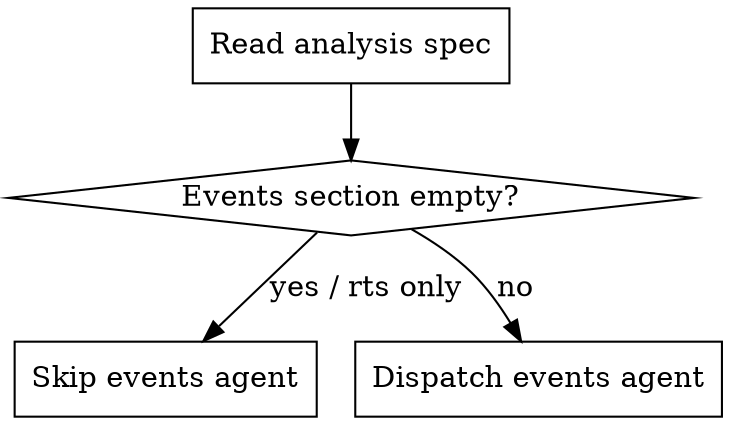

# S3K Zone Bring-Up Skills Implementation Plan

> **For agentic workers:** REQUIRED SUB-SKILL: Use superpowers:subagent-driven-development (recommended) or superpowers:executing-plans to implement this plan task-by-task. Steps use checkbox (`- [ ]`) syntax for tracking.

**Goal:** Create 7 skills (6 new + 1 update) that enable systematic, agent-driven bring-up of S3K zone features (events, parallax, animated tiles, palette cycling) with ROM accuracy.

**Architecture:** Three-layer skill system — analysis reads the disassembly and produces a zone spec, feature skills implement individual categories using the spec, orchestrator dispatches feature agents in parallel and merges results. Validation uses stable-retro + image recognition.

**Tech Stack:** Markdown skills (.claude/skills + .agent/skills), Java 21, 68000 assembly (docs/skdisasm/), RomOffsetFinder

**Spec:** `docs/superpowers/specs/2026-04-04-s3k-zone-bring-up-system-design.md`

---

## File Map

**New files:**
- `.claude/skills/s3k-zone-analysis/skill.md` — Analysis skill (Claude Code)
- `.claude/skills/s3k-zone-events/skill.md` — Zone events skill (Claude Code)
- `.claude/skills/s3k-animated-tiles/skill.md` — Animated tiles skill (Claude Code)
- `.claude/skills/s3k-palette-cycling/skill.md` — Palette cycling skill (Claude Code)
- `.claude/skills/s3k-zone-bring-up/skill.md` — Orchestrator skill (Claude Code)
- `.claude/skills/s3k-zone-validate/skill.md` — Validation skill (Claude Code)
- `.agent/skills/s3k-zone-analysis/skill.md` — Analysis skill (agent-agnostic)
- `.agent/skills/s3k-zone-events/skill.md` — Zone events skill (agent-agnostic)
- `.agent/skills/s3k-animated-tiles/skill.md` — Animated tiles skill (agent-agnostic)
- `.agent/skills/s3k-palette-cycling/skill.md` — Palette cycling skill (agent-agnostic)
- `.agent/skills/s3k-zone-bring-up/skill.md` — Orchestrator skill (agent-agnostic)
- `.agent/skills/s3k-zone-validate/skill.md` — Validation skill (agent-agnostic)
- `docs/s3k-zones/.gitkeep` — Zone analysis output directory

**Modified files:**
- `.claude/skills/s3k-parallax/skill.md` — Add analysis spec input section

---

### Task 1: Create directory structure

**Files:**
- Create: `docs/s3k-zones/.gitkeep`
- Create: `.agent/skills/s3k-zone-analysis/.gitkeep` (ensures dir exists)
- Create: `.agent/skills/s3k-zone-events/.gitkeep`
- Create: `.agent/skills/s3k-animated-tiles/.gitkeep`
- Create: `.agent/skills/s3k-palette-cycling/.gitkeep`
- Create: `.agent/skills/s3k-zone-bring-up/.gitkeep`
- Create: `.agent/skills/s3k-zone-validate/.gitkeep`

- [ ] **Step 1: Create directories**

```bash
mkdir -p docs/s3k-zones
mkdir -p .agent/skills/s3k-zone-analysis
mkdir -p .agent/skills/s3k-zone-events
mkdir -p .agent/skills/s3k-animated-tiles
mkdir -p .agent/skills/s3k-palette-cycling
mkdir -p .agent/skills/s3k-zone-bring-up
mkdir -p .agent/skills/s3k-zone-validate
touch docs/s3k-zones/.gitkeep
```

- [ ] **Step 2: Commit**

```bash
git add docs/s3k-zones/.gitkeep
git commit -m "chore: create s3k zone bring-up directory structure"
```

---

### Task 2: Write s3k-zone-analysis skill

The most critical skill. Teaches an agent to autonomously read the S3K disassembly and produce a structured zone feature catalogue.

**Files:**
- Create: `.claude/skills/s3k-zone-analysis/skill.md`
- Create: `.agent/skills/s3k-zone-analysis/skill.md`

- [ ] **Step 1: Write the Claude Code skill**

Create `.claude/skills/s3k-zone-analysis/skill.md`:

````markdown
---
name: s3k-zone-analysis
description: Use when starting work on a new S3K zone to catalogue its features from the disassembly. Reads Dynamic_Resize, Deform, AniPLC, and AnPal routines and produces a structured zone analysis spec.
---

# S3K Zone Analysis

Read the Sonic 3&K disassembly for a target zone and produce a structured feature catalogue. This is the first step in the zone bring-up process — all feature implementation skills consume this analysis as input.

## Inputs

$ARGUMENTS: Zone abbreviation (e.g., "HCZ", "LBZ", "CNZ")

## Related Skills

- **s3k-disasm-guide** (`.claude/skills/s3k-disasm-guide/skill.md`) for disassembly navigation, label conventions, RomOffsetFinder commands, and zone abbreviations.

## Zone Reference

| Index | Abbr | Full Name | Zone Set |
|-------|------|-----------|----------|
| 0x00 | AIZ | Angel Island | S3KL |
| 0x01 | HCZ | Hydrocity | S3KL |
| 0x02 | MGZ | Marble Garden | S3KL |
| 0x03 | CNZ | Carnival Night | S3KL |
| 0x04 | FBZ | Flying Battery | S3KL |
| 0x05 | ICZ | IceCap | S3KL |
| 0x06 | LBZ | Launch Base | S3KL |
| 0x07 | MHZ | Mushroom Hill | SKL |
| 0x08 | SOZ | Sandopolis | SKL |
| 0x09 | LRZ | Lava Reef | SKL |
| 0x0A | SSZ | Sky Sanctuary | SKL |
| 0x0B | DEZ | Death Egg | SKL |
| 0x0C | DDZ | Doomsday | SKL |

## Analysis Process

### Phase 1: Find Zone Routines

For each feature category, search the disassembly. All searches target `docs/skdisasm/sonic3k.asm` unless noted.

**1.1 Events (Dynamic_Resize)**

```bash
grep -n "Dynamic_Resize_\|_Resize_Routine\|_ScreenInit\|_ScreenEvent\|_BackgroundInit\|_BackgroundEvent" docs/skdisasm/sonic3k.asm | grep -i "{ZONE}"
```

Look for:
- `Dynamic_Resize_{ZONE}` — main event dispatcher
- `{ZONE}_ScreenInit` / `{ZONE}_ScreenEvent` — screen setup/transitions
- `{ZONE}_BackgroundInit` / `{ZONE}_BackgroundEvent` — BG setup/transitions
- Sub-labels like `Dynamic_Resize_{ZONE}.routine_2`, `.routine_4` etc.

**1.2 Parallax (Deform)**

```bash
grep -n "{ZONE}_Deform\|{ZONE}1_Deform\|{ZONE}2_Deform\|SwScrl_{ZONE}" docs/skdisasm/sonic3k.asm
```

Also find data tables:
```bash
grep -n "{ZONE}.*DeformArray\|{ZONE}.*DeformIndex\|{ZONE}.*DeformOffset\|{ZONE}.*Waterline" docs/skdisasm/sonic3k.asm
```

Check for external data files:
```bash
find docs/skdisasm/Levels/{ZONE}/Misc/ -name "*Waterline*" -o -name "*Scroll*" -o -name "*Deform*" 2>/dev/null
```

**1.3 Animated Tiles (AniPLC)**

Search for the zone's AniPLC table entries:
```bash
grep -n "AniPLC_{ZONE}\|Animated_Tiles_{ZONE}\|AniArt_{ZONE}" docs/skdisasm/sonic3k.asm
```

If no direct label, find the master AniPLC table and locate entries for the zone index:
```bash
grep -n "AniPLC_Table\|AniPLC_Index" docs/skdisasm/sonic3k.asm
```

**1.4 Palette Cycling (AnPal)**

```bash
grep -n "AnPal_{ZONE}\|AnPal_{ZONE}1\|AnPal_{ZONE}2" docs/skdisasm/sonic3k.asm
```

Also find palette data tables:
```bash
grep -n "Pal_{ZONE}\|Palette_{ZONE}" docs/skdisasm/sonic3k.asm
```

**1.5 Objects**

Find the zone's object layout files:
```bash
find docs/skdisasm/Levels/{ZONE}/ -name "Object*" -o -name "Ring*" 2>/dev/null
```

Find zone-specific object code by searching for the zone abbreviation in object files:
```bash
grep -rn "Obj_{ZONE}\|{ZONE}_Obj\|{ZONE}.*Object" docs/skdisasm/ --include="*.asm" | head -30
```

### Phase 2: Read and Extract Features

For each routine found, read the full assembly code. Focus on extracting:

**Event routines — look for:**
- `cmpi.w #$XXXX, (Camera_X_pos).w` — camera position thresholds
- `move.w #$XXXX, (Camera_*_bound).w` — boundary changes (camera locks)
- `move.b #$XX, (Dynamic_Resize_routine).w` — routine counter advances
- `move.b #$XX, (Boss_flag).w` — boss flag changes
- `bsr.w Process_Boss` / `jsr (SingleObjLoad).l` — boss/object spawning
- `cmpi.b #$XX, (Player_mode).w` — character branching (0=S&T, 1=S, 2=T, 3=K)
- `move.l #$XXXXXXXX, (Palette_fade_range).w` — palette manipulation
- `jsr (PalLoad_Line).l` — palette loading
- `bsr.w LoadPLC` — PLC-driven art loading

**Deform routines — look for:**
- Height arrays (sequences of `dc.w` values defining parallax band heights)
- `move.w (Camera_BG_X_pos).w, dN` — BG camera position reads
- Speed divisors: `asr.w #N` or `lsr.w #N` — parallax speed ratios
- Scatter-fill index tables (non-sequential `dc.b` values mapping bands to HScroll_table entries)
- `(Water_Level_1).w` references — water split handling
- Fine deformation deltas (per-line sin/cos wave offsets)

**AniPLC entries — look for:**
- Script format: duration byte, art ROM address (24-bit), VRAM destination, frame count
- Total script count per zone/act
- References from event routines that gate animation (Dynamic_Resize_routine checks, Boss_flag)

**AnPal routines — look for:**
- `subq.w #1, (Pal_{ZONE}_counter).w` / `bne.s +` — counter decrement pattern
- `move.w #$XXXX, (Pal_{ZONE}_counter).w` — counter reload (this is the "limit")
- `lea (Pal_{ZONE}_data).l, aN` — palette data table reference
- `move.w (Pal_{ZONE}_index).w, dN` — cycling index (the "step")
- `cmpi.w #$XXXX, dN` / `blo.s` — index wrap-around check
- How many independent cycling channels the zone has

### Phase 3: Assess Confidence and Flag Concerns

**Confidence levels:**
- **HIGH:** Standard patterns with clear ROM equivalents. "6 parallax bands with scatter-fill deform" or "3 AnPal channels with counter/step/limit."
- **MEDIUM:** Understood but complex. Multi-phase boss sequences, conditional art loading, water level changes during gameplay.
- **LOW:** Ambiguous branches, indirect jumps (`jmp (aN)`), routines that reference external state not yet understood. Flag these explicitly.

**Cross-cutting concerns checklist:**
- [ ] Does the zone have water? (check `(Water_flag).w`, `(Water_Level_1).w` references)
- [ ] Screen shake? (check `(Screen_shake_flag).w`, earthquake routines)
- [ ] Act transition? (mid-level transition like AIZ fire, HCZ underwater→surface)
- [ ] Character-specific paths? (Knuckles different route, different boss)
- [ ] Dynamic tilemap changes? (boss destroying level, terrain swaps)
- [ ] PLC loading during gameplay? (art loaded mid-level, not just at level start)
- [ ] Unique mechanics? (CNZ barrels, ICZ snowboard, SOZ time-of-day, DDZ flight)

### Phase 4: Write the Analysis Spec

Save output to `docs/s3k-zones/{zone-lower}-analysis.md` using this format:

```
# {Zone Full Name} ({ABBR}) — Zone Analysis

## Summary
One paragraph: zone's visual character, key mechanics, complexity assessment.

## Events (Dynamic_Resize_{ZONE})

### Act 1
For each routine step:
- Routine N: [what it does] — trigger: [condition] (confidence: HIGH/MEDIUM/LOW)
  - disasm: `Dynamic_Resize_{ZONE}.routine_N` (line ~NNNNN)

### Act 2
[Same structure]

### Boss Sequences
- Mini-boss: [object label], spawned at routine N, camera lock at (X, Y)-(X2, Y2)
- End boss: [object label], spawned at routine N, special mechanics: [description]

### Character Branching
- [Sonic/Tails path differences vs Knuckles path]

## Parallax ({ZONE}_Deform)

- Band count: N
- Deform type: [standard / scatter-fill / per-line]
- Water split: [yes/no — if yes, which scanline boundary]
- Per-act differences: [same routine vs separate routines]
- Data tables:
  - `{ZONE}_DeformArray` (line ~NNNNN) — [N] height entries
  - `{ZONE}_DeformIndex` (line ~NNNNN) — scatter-fill indices [if applicable]

## Animated Tiles (AniPLC)

- Script count: N per act
- Per script:
  - Index N: [VRAM dest tile], [frame count] frames, [tiles per frame] tiles — [description]
- Gating conditions: [Dynamic_Resize_routine >= N, Boss_flag == 0, camera X >= threshold]
- Dynamic art overrides: [any non-AniPLC art loaded by events]

## Palette Cycling (AnPal_{ZONE})

- Channel count: N
- Per channel:
  - Channel N: palette line [L], colors [start-end], rate [counter reload], [description]
- Already implemented in engine: [yes/no]
- If yes, validation notes: [any concerns about accuracy]

## Objects (Notable)

| Object ID | Label | Description | Zone-Set |
|-----------|-------|-------------|----------|
| 0xNN | Obj_Name | [brief] | S3KL/SKL |

(Focus on zone-specific objects and bosses, not generic objects like springs/spikes)

## Cross-Cutting Concerns

- [Water system details if applicable]
- [Screen shake sources]
- [Act transition mechanics]
- [Unique zone mechanics]

## Implementation Notes

- [Dependencies between features]
- [Recommended implementation order]
- [Known gotchas or unusual patterns]
```

## Common Mistakes

- **Searching only `sonic3k.asm`** — Some zone data lives in separate files under `docs/skdisasm/Levels/{ZONE}/`. Always check both.
- **Missing character branching** — Many zones have subtle `Player_mode` checks. Search for `Player_mode` within the zone's routines.
- **Confusing palette mutation with palette cycling** — Mutations are camera-threshold writes in Dynamic_Resize (events). Cycling is timer-based in AnPal (palette cycling). They target different palette entries. Both must be documented.
- **Assuming act symmetry** — Act 1 and Act 2 often have different deform routines, different AniPLC scripts, and different event sequences. Always check both acts.
- **Missing boss art loading** — Bosses often load art via PLC in the event handler before spawning the boss object. Document the PLC call, not just the object spawn.
````

- [ ] **Step 2: Create .agent mirror**

Copy `.claude/skills/s3k-zone-analysis/skill.md` to `.agent/skills/s3k-zone-analysis/skill.md` with identical content.

- [ ] **Step 3: Commit**

```bash
git add .claude/skills/s3k-zone-analysis/skill.md .agent/skills/s3k-zone-analysis/skill.md
git commit -m "feat: add s3k-zone-analysis skill for disassembly-driven zone feature cataloguing"
```

---

### Task 3: Write s3k-zone-events skill

Teaches an agent to implement zone event handlers (Dynamic_Resize) — camera locks, boss arenas, cutscenes, act transitions, palette mutations.

**Files:**
- Create: `.claude/skills/s3k-zone-events/skill.md`
- Create: `.agent/skills/s3k-zone-events/skill.md`

- [ ] **Step 1: Write the Claude Code skill**

Create `.claude/skills/s3k-zone-events/skill.md`:

````markdown
---
name: s3k-zone-events
description: Use when implementing S3K zone event handlers — camera locks, boss arenas, cutscenes, act transitions, palette mutations. Ports Dynamic_Resize routines from the disassembly.
---

# Implement S3K Zone Events

Implement zone-specific event handlers for Sonic 3&K. These correspond to the `Dynamic_Resize_{ZONE}` routines in the disassembly — the per-frame logic that manages camera boundaries, boss spawning, act transitions, and other level scripting.

## Inputs

$ARGUMENTS: Zone abbreviation + optional path to zone analysis spec (e.g., "HCZ", "HCZ docs/s3k-zones/hcz-analysis.md")

## Related Skills

- **s3k-disasm-guide** (`.claude/skills/s3k-disasm-guide/skill.md`) for disassembly navigation and label conventions.
- **s3k-zone-analysis** (`.claude/skills/s3k-zone-analysis/skill.md`) for producing the zone analysis spec if one doesn't exist yet.
- **s3k-plc-system** (`.claude/skills/s3k-plc-system/skill.md`) for PLC-driven art loading during act transitions and boss arenas.

## Architecture

```
AbstractLevelEventManager (game/)
    |
    v
Sonic3kLevelEventManager (game/sonic3k/)
    |  — dispatches to zone-specific handlers
    v
Sonic3kZoneEvents (game/sonic3k/events/)          [abstract base]
    |
    v
Sonic3k{Zone}Events (game/sonic3k/events/)         [concrete per-zone]
```

### Base Class: `Sonic3kZoneEvents`

Package: `com.openggf.game.sonic3k.events`

Provides:
- `eventRoutine` field — state machine counter (advances by 2: 0, 2, 4, 6...)
- `bossSpawnDelay` field — countdown before boss object creation
- `init(int act)` — reset state per level load
- `update(int act, int frameCounter)` — abstract, called every frame
- Service accessors: `camera()`, `levelManager()`, `rom()`, `audio()`, `gameState()`, `waterSystem()`, `spriteManager()`
- `spawnObject(ObjectInstance)` — dynamic object spawning
- `loadPalette(int paletteLine, int romAddr)` — load ROM palette data
- `loadPaletteFromPalPointers(int palPointersIndex)` — load from PalPointers table
- `applyPlc(int plcId)` — apply Pattern Load Cue

### Registration in `Sonic3kLevelEventManager`

The manager dispatches to zone handlers. Each zone needs:

1. A private field for the handler instance
2. Construction + init in `onInitLevel()` keyed by zone ID
3. Update dispatch in `onUpdate()` with null check
4. Reset in `resetState()`

## Implementation Process

### Phase 1: Read the Zone Analysis Spec

If a zone analysis spec exists at `docs/s3k-zones/{zone}-analysis.md`, read it first. Focus on the **Events (Dynamic_Resize)** section for:
- Routine counter progression per act
- Camera position thresholds
- Boss spawn sequences
- Character branching points
- Palette mutation thresholds

If no spec exists, run the **s3k-zone-analysis** skill first.

### Phase 2: Read the Disassembly

Using references from the analysis spec, read the actual assembly routines. The spec summarises; the assembly is the source of truth.

Find the zone's Dynamic_Resize routine:
```bash
grep -n "Dynamic_Resize_{ZONE}" docs/skdisasm/sonic3k.asm
```

Read the full routine and all sub-labels (`.routine_0`, `.routine_2`, etc.). Map each routine step to:
- **Trigger condition** — what causes progression to the next routine
- **Actions** — what the routine does (boundary changes, spawns, palette loads)
- **Side effects** — PLC calls, music changes, flag writes

### Phase 3: Create the Zone Events Class

Create `src/main/java/com/openggf/game/sonic3k/events/Sonic3k{Zone}Events.java`:

```java
package com.openggf.game.sonic3k.events;

import com.openggf.game.sonic3k.constants.Sonic3kConstants;
import com.openggf.game.sonic3k.constants.Sonic3kAudioConstants;
import com.openggf.game.sonic3k.Sonic3kLoadBootstrap;

/**
 * Zone events for {Zone Full Name} ({ABBR}).
 * Ports: Dynamic_Resize_{ZONE} (sonic3k.asm line ~NNNNN)
 */
public class Sonic3k{Zone}Events extends Sonic3kZoneEvents {

    // Camera thresholds from disassembly (convert hex to decimal)
    private static final int ROUTINE_2_THRESHOLD_X = 0x...;
    // ... more constants from the disassembly

    private final Sonic3kLoadBootstrap bootstrap;

    public Sonic3k{Zone}Events(Sonic3kLoadBootstrap bootstrap) {
        this.bootstrap = bootstrap;
    }

    @Override
    public void update(int act, int frameCounter) {
        if (act == 0) {
            updateAct1(frameCounter);
        } else {
            updateAct2(frameCounter);
        }
    }

    private void updateAct1(int frameCounter) {
        switch (eventRoutine) {
            case 0 -> act1Routine0();
            case 2 -> act1Routine2();
            // ... more routines from disassembly
        }
    }

    private void act1Routine0() {
        // Port the assembly logic:
        // cmpi.w #$XXXX, (Camera_X_pos).w → if (camera().getX() >= THRESHOLD)
        // move.w #$XXXX, (Camera_*_bound).w → camera().set*Bound(value)
        // addq.b #2, (Dynamic_Resize_routine).w → eventRoutine += 2
    }
}
```

### Phase 4: Register in Sonic3kLevelEventManager

Add the handler to `Sonic3kLevelEventManager.java`:

**Add field:**
```java
private Sonic3k{Zone}Events {zone}Events;
```

**Add to `onInitLevel()`:**
```java
case Sonic3kZoneIds.ZONE_{ZONE} -> {
    {zone}Events = new Sonic3k{Zone}Events(bootstrap);
    {zone}Events.init(act);
}
```

**Add to `onUpdate()`:**
```java
if ({zone}Events != null && currentZone == Sonic3kZoneIds.ZONE_{ZONE}) {
    {zone}Events.update(currentAct, frameCounter);
}
```

**Add to `resetState()`:**
```java
{zone}Events = null;
```

### Phase 5: Build and Verify

```bash
mvn package -q
```

Expected: BUILD SUCCESS. If compilation fails, fix errors before proceeding.

## Assembly-to-Java Translation Reference

| 68000 Assembly | Java Equivalent |
|----------------|-----------------|
| `(Camera_X_pos).w` | `camera().getX()` |
| `(Camera_Y_pos).w` | `camera().getY()` |
| `(Camera_Min_X_pos).w` | `camera().getLeftBound()` / `camera().setLeftBound(v)` |
| `(Camera_Max_X_pos).w` | `camera().getRightBound()` / `camera().setRightBound(v)` |
| `(Camera_Max_Y_pos_now).w` | `camera().getBottomBound()` / `camera().setBottomBound(v)` |
| `(Camera_Min_Y_pos).w` | `camera().getTopBound()` / `camera().setTopBound(v)` |
| `(Dynamic_Resize_routine).w` | `eventRoutine` |
| `(Boss_flag).w` | read via `gameState()` or local field |
| `(Player_mode).w` | `gameState().getPlayerCharacter()` |
| `addq.b #2, (Dynamic_Resize_routine).w` | `eventRoutine += 2;` |
| `jsr (SingleObjLoad).l` | `spawnObject(new ObjectInstance(spawn))` |
| `jsr (PalLoad_Line).l` | `loadPalette(line, addr)` or `loadPaletteFromPalPointers(idx)` |
| `jsr (LoadPLC).l` | `applyPlc(plcId)` |
| `move.w #$XXXX, (Level_Music).w` | `audio().playMusic(Sonic3kAudioConstants.BGM_XXX)` |

## Character Branching Pattern

Many zones branch on `Player_mode`:
```
cmpi.b #3, (Player_mode).w    ; 3 = Knuckles
beq.s  .knuckles_path
; Sonic/Tails path
...
.knuckles_path:
; Knuckles-specific events
```

Java equivalent:
```java
import com.openggf.game.PlayerCharacter;

if (GameServices.gameState().getPlayerCharacter() == PlayerCharacter.KNUCKLES) {
    updateKnucklesPath(frameCounter);
} else {
    updateSonicTailsPath(frameCounter);
}
```

## Palette Mutations vs Palette Cycling

**Critical distinction:**
- **Palette mutations** live HERE in zone events. They are camera-position-triggered one-shot writes (e.g., AIZ hollow tree darkening at camera X >= 0x2B00).
- **Palette cycling** lives in `Sonic3kPaletteCycler`. Timer-based continuous animation (e.g., waterfall shimmer).

If you see `move.w #$XXXX, (Target_palette+$XX).w` in a Dynamic_Resize routine gated by a camera threshold, it's a mutation. Implement it in the events class.

## Boss Spawn Coordination Pattern

```java
private void spawnBoss() {
    // 1. Lock camera
    camera().setLeftBound(bossArenaX);
    camera().setRightBound(bossArenaX + 320);
    camera().setBottomBound(bossArenaY + 224);

    // 2. Load boss art via PLC (if needed)
    applyPlc(BOSS_PLC_ID);

    // 3. Play boss music
    audio().playMusic(Sonic3kAudioConstants.BGM_MINIBOSS); // or BGM_BOSS

    // 4. Spawn boss object
    var spawn = buildSpawnAt(bossX, bossY);
    spawnObject(new BossInstance(spawn));

    // 5. Advance routine
    eventRoutine += 2;
}
```

## Common Mistakes

- **Forgetting to advance `eventRoutine`** — every routine step must advance the counter or the event stalls forever.
- **Using pixel coordinates directly from disassembly** — VDP adds 128 to X/Y for sprite positions, but camera positions are direct screen coordinates in both the ROM and our engine. No conversion needed for camera bounds.
- **Missing the bootstrap skip path** — if the zone has an intro sequence (like AIZ), check `bootstrap.isSkipIntro()` to handle special stage returns that bypass the intro.
- **Implementing palette cycling in events** — only palette MUTATIONS belong here. Cycling belongs in `s3k-palette-cycling`.
````

- [ ] **Step 2: Create .agent mirror**

Copy `.claude/skills/s3k-zone-events/skill.md` to `.agent/skills/s3k-zone-events/skill.md` with identical content.

- [ ] **Step 3: Commit**

```bash
git add .claude/skills/s3k-zone-events/ .agent/skills/s3k-zone-events/
git commit -m "feat: add s3k-zone-events skill for implementing zone event handlers"
```

---

### Task 4: Write s3k-animated-tiles skill

Teaches an agent to implement animated tile triggers in `Sonic3kPatternAnimator` using AniPLC scripts from the disassembly.

**Files:**
- Create: `.claude/skills/s3k-animated-tiles/skill.md`
- Create: `.agent/skills/s3k-animated-tiles/skill.md`

- [ ] **Step 1: Write the Claude Code skill**

Create `.claude/skills/s3k-animated-tiles/skill.md`:

````markdown
---
name: s3k-animated-tiles
description: Use when implementing S3K animated tile triggers for a zone — AniPLC script registration, gating conditions, dynamic art overrides in Sonic3kPatternAnimator.
---

# Implement S3K Animated Tiles

Implement zone-specific animated tile triggers for Sonic 3&K. The engine uses AniPLC (Animated Pattern Load Cue) scripts — binary sequences that cycle tile art at timed intervals. Each zone has its own scripts with zone-specific gating conditions (intro phases, boss fights, camera position).

## Inputs

$ARGUMENTS: Zone abbreviation + optional path to zone analysis spec (e.g., "HCZ", "HCZ docs/s3k-zones/hcz-analysis.md")

## Related Skills

- **s3k-disasm-guide** (`.claude/skills/s3k-disasm-guide/skill.md`) for disassembly navigation.
- **s3k-zone-analysis** (`.claude/skills/s3k-zone-analysis/skill.md`) for producing the analysis spec if needed.
- **s3k-plc-system** (`.claude/skills/s3k-plc-system/skill.md`) for understanding PLC-driven art loading that interacts with animated tiles.

## Architecture

```
Sonic3kLevelAnimationManager
    |
    v  calls per frame
Sonic3kPatternAnimator (implements AnimatedPatternManager)
    |
    v  update(zoneIndex, actIndex)
Zone-specific switch case
    |
    v  decides which scripts to run based on game state
runAllScripts() / runScript(index) / skip
```

### AniPLC Script Format

Each script is a binary sequence in ROM:
- **Duration byte** — frames between art updates
- **Art ROM address** (24-bit) — source of tile art
- **VRAM destination** — tile index where art is written
- **Frame count** — number of animation frames
- **Tiles per frame** — how many 8x8 tiles per animation frame

Scripts are indexed per zone/act. The `resolveAniPlcAddr()` method returns the ROM address of the zone's AniPLC table.

### Key Classes

| Class | Purpose |
|-------|---------|
| `Sonic3kPatternAnimator` | Main animator, zone switch dispatch |
| `Sonic3kConstants` | ROM addresses for AniPLC tables |
| `Sonic3kLevelAnimationManager` | Lifecycle coordinator |

## Implementation Process

### Phase 1: Read the Analysis Spec

Read `docs/s3k-zones/{zone}-analysis.md`, focus on **Animated Tiles (AniPLC)** section:
- Script count per act
- VRAM destinations and descriptions
- Gating conditions

If no spec exists, run **s3k-zone-analysis** first.

### Phase 2: Find AniPLC Addresses

Use RomOffsetFinder to locate the zone's AniPLC data:
```bash
mvn exec:java -Dexec.mainClass="com.openggf.tools.disasm.RomOffsetFinder" \
    -Dexec.args="--game s3k search AniPLC_{ZONE}" -q
```

If no direct label exists, find the master AniPLC table:
```bash
grep -n "AniPLC_Table\|AniPLC_Primary\|off_.*AniPLC" docs/skdisasm/sonic3k.asm
```

Then locate the zone's entries by index (zone index × entries per zone).

### Phase 3: Add ROM Constants

Add to `Sonic3kConstants.java`:
```java
/** AniPLC table for {Zone} Act 1. Source: AniPLC_{ZONE}1 (sonic3k.asm line ~NNNNN) */
public static final int ANIPLC_{ZONE}1_ADDR = 0x...;
/** AniPLC table for {Zone} Act 2 (if different from Act 1) */
public static final int ANIPLC_{ZONE}2_ADDR = 0x...;
```

### Phase 4: Add Zone Case to Sonic3kPatternAnimator

**4.1 Add to `resolveAniPlcAddr()`:**
```java
private static int resolveAniPlcAddr(int zoneIndex, int actIndex) {
    // ... existing cases ...
    if (zoneIndex == N) {  // {ZONE} zone index
        return actIndex == 0
                ? Sonic3kConstants.ANIPLC_{ZONE}1_ADDR
                : Sonic3kConstants.ANIPLC_{ZONE}2_ADDR;
    }
    return -1;
}
```

**4.2 Add zone case to `update()`:**
```java
case N -> {  // {ZONE}
    if (actIndex == 0) {
        update{Zone}1();
    } else {
        update{Zone}2();
    }
}
```

**4.3 Implement zone-specific update methods:**

The simplest case (no gating):
```java
private void update{Zone}1() {
    runAllScripts();
}
```

With gating (e.g., suppress during boss):
```java
private void update{Zone}1() {
    if (bossFlag) return;  // Don't animate during boss fight
    runAllScripts();
}
```

With conditional scripts (e.g., different scripts based on camera position):
```java
private void update{Zone}2() {
    if (camera.getX() < THRESHOLD) {
        runScript(0);  // Only first script before threshold
    } else {
        runAllScripts();  // All scripts after threshold
    }
}
```

### Phase 5: Build and Verify

```bash
mvn package -q
```

## Gating Conditions Reference

Common gating patterns from the disassembly:

| Condition | Assembly | Java |
|-----------|----------|------|
| After intro | `tst.b (Dynamic_Resize_routine).w / beq` | Check event routine via shared state |
| Not during boss | `tst.b (Boss_flag).w / bne` | `if (bossFlag) return;` |
| Camera past X | `cmpi.w #$XXXX, (Camera_X_pos).w` | `if (camera.getX() >= threshold)` |
| Specific act only | `tst.b (Current_act).w` | `if (actIndex == 0)` |

## Dynamic Art Overrides

Some zones load art outside the AniPLC system — typically in event handlers or during act transitions. If the analysis spec mentions dynamic art overrides:

1. The art is usually loaded once (not animated), replacing tiles at a specific VRAM destination
2. It may conflict with AniPLC scripts targeting the same VRAM range
3. The animated tile update method must check whether the override is active and skip conflicting scripts

Example (from AIZ Act 2 — FirstTree art override):
```java
if (camera.getX() < FIRST_TREE_THRESHOLD) {
    runScript(0);  // Only fire animation
    // FirstTree static art loaded separately, occupies tiles that script 1+ would overwrite
} else {
    runAllScripts();  // FirstTree art no longer needed, safe to animate all
}
```

## Common Mistakes

- **Wrong AniPLC address** — verify with RomOffsetFinder's `verify` command. The address must point to the script table header, not the first script entry.
- **Missing gating** — running scripts during the intro phase or boss fight when the ROM suppresses them. Always check the analysis spec for gating conditions.
- **Act 1 ≠ Act 2** — many zones have different script counts or different gating per act. Don't assume symmetry.
- **Forgetting `resolveAniPlcAddr()`** — adding the switch case in `update()` without also adding the address resolution causes scripts to silently not load.
````

- [ ] **Step 2: Create .agent mirror**

Copy to `.agent/skills/s3k-animated-tiles/skill.md` with identical content.

- [ ] **Step 3: Commit**

```bash
git add .claude/skills/s3k-animated-tiles/ .agent/skills/s3k-animated-tiles/
git commit -m "feat: add s3k-animated-tiles skill for AniPLC script implementation"
```

---

### Task 5: Write s3k-palette-cycling skill

Teaches an agent to implement or validate AnPal palette cycling handlers in `Sonic3kPaletteCycler`.

**Files:**
- Create: `.claude/skills/s3k-palette-cycling/skill.md`
- Create: `.agent/skills/s3k-palette-cycling/skill.md`

- [ ] **Step 1: Write the Claude Code skill**

Create `.claude/skills/s3k-palette-cycling/skill.md`:

````markdown
---
name: s3k-palette-cycling
description: Use when implementing or validating S3K palette cycling (AnPal handlers) for a zone — counter/step/limit cycling, palette line targets, ROM data verification in Sonic3kPaletteCycler.
---

# Implement S3K Palette Cycling

Implement or validate zone-specific palette cycling for Sonic 3&K. These correspond to the `AnPal_{ZONE}` routines in the disassembly — timer-based palette animation that creates effects like waterfall shimmer, lava glow, and light flickering.

## Inputs

$ARGUMENTS: Zone abbreviation + mode (e.g., "HCZ", "HCZ validate", "CNZ implement")

- **implement** (default): Create new AnPal handler from disassembly
- **validate**: Verify existing implementation against disassembly, fix discrepancies

## Related Skills

- **s3k-disasm-guide** (`.claude/skills/s3k-disasm-guide/skill.md`) for disassembly navigation.
- **s3k-zone-analysis** (`.claude/skills/s3k-zone-analysis/skill.md`) for the zone analysis spec.

## Architecture

```
Sonic3kLevelAnimationManager
    |
    v  calls per frame
Sonic3kPaletteCycler (implements AnimatedPaletteManager)
    |
    v  loadCycles(zoneIndex, actIndex) on level load
    |     creates PaletteCycle list from ROM data
    v  update() per frame
    |     ticks each PaletteCycle
    v
PaletteCycle inner classes (per zone)
    |
    v  writes colors to palette RAM
```

### Counter/Step/Limit Pattern

The ROM uses a consistent pattern for palette cycling (documented in AGENTS_S3K.md):

```
AnPal_{ZONE}:
    subq.w  #1, (Pal_{ZONE}_counter).w     ; decrement counter
    bne.s   +                                ; skip if not zero
    move.w  #LIMIT, (Pal_{ZONE}_counter).w  ; reload counter
    ; ... advance palette index and write colors ...
+   rts
```

Java equivalent:
```java
if (--counter <= 0) {
    counter = limit;   // reload
    index += step;     // advance
    if (index >= maxIndex) index = 0;  // wrap
    // write palette colors from ROM data at current index
}
```

**Terminology mapping:**
- **Counter** = frames until next color change (decremented each frame)
- **Limit** = counter reload value (determines cycling speed)
- **Step** = how many colors to advance per cycle (usually 1 entry = N colors)
- **Index** = current position in the color table

### Palette Cycling vs Palette Mutation

**CRITICAL:** This skill covers only **cycling** (timer-based, continuous). Palette **mutations** (camera-threshold one-shot writes in `Dynamic_Resize`) belong in the **s3k-zone-events** skill.

## Implementation Process

### Phase 1: Read the Analysis Spec

Read `docs/s3k-zones/{zone}-analysis.md`, focus on **Palette Cycling (AnPal)** section:
- Channel count
- Palette line and color range per channel
- Cycling rate (counter reload value)
- Whether already implemented

### Phase 2: Read the Disassembly

Find the AnPal routine:
```bash
grep -n "AnPal_{ZONE}\b" docs/skdisasm/sonic3k.asm
```

For each cycling channel, extract:
1. **Counter reload value** (the `move.w #LIMIT` operand)
2. **Palette destination** (target address in palette RAM, convert to line + color index)
3. **Color table ROM address** (the `lea` source operand)
4. **Color table size** (determines wrap point)
5. **Colors per step** (how many words written per cycle)

### Phase 3: Find ROM Addresses

Use RomOffsetFinder to verify palette data addresses:
```bash
mvn exec:java -Dexec.mainClass="com.openggf.tools.disasm.RomOffsetFinder" \
    -Dexec.args="--game s3k search Pal_{ZONE}" -q
```

### Phase 4: Add ROM Constants (if not already present)

Add to `Sonic3kConstants.java`:
```java
/** AnPal data for {Zone} channel N. Source: AnPal_{ZONE} (sonic3k.asm line ~NNNNN) */
public static final int ANPAL_{ZONE}_{N}_ADDR = 0x...;
public static final int ANPAL_{ZONE}_{N}_SIZE = ...;  // bytes
```

### Phase 5: Implement or Validate

**For new implementations:**

Add a case to `Sonic3kPaletteCycler.loadCycles()`:
```java
case 0xNN: // {ZONE}
    if (actIndex == 0) {
        load{Zone}1Cycles(reader, list);
    } else {
        load{Zone}2Cycles(reader, list);
    }
    break;
```

Implement the loader method:
```java
private void load{Zone}1Cycles(RomByteReader reader, List<PaletteCycle> list) {
    // Channel 1: [description]
    byte[] data1 = reader.readBytes(Sonic3kConstants.ANPAL_{ZONE}_1_ADDR,
                                     Sonic3kConstants.ANPAL_{ZONE}_1_SIZE);
    list.add(new {Zone}Cycle1(data1));

    // Channel 2: [description] (if applicable)
    // ...
}
```

Implement the PaletteCycle inner class:
```java
private static class {Zone}Cycle1 implements PaletteCycle {
    private final byte[] data;
    private int counter;
    private int index;

    // Constants from disassembly
    private static final int LIMIT = ...;     // counter reload
    private static final int COLORS_PER_STEP = ...; // words written per cycle
    private static final int PALETTE_LINE = ...;    // target palette line (0-3)
    private static final int COLOR_START = ...;     // first color index in line
    private static final int TOTAL_ENTRIES = ...;   // wrap point

    {Zone}Cycle1(byte[] data) {
        this.data = data;
        this.counter = LIMIT;
        this.index = 0;
    }

    @Override
    public void tick(int[] palette) {
        if (--counter > 0) return;
        counter = LIMIT;

        int baseIndex = PALETTE_LINE * 16 + COLOR_START;
        for (int i = 0; i < COLORS_PER_STEP; i++) {
            int dataOffset = (index + i) * 2;  // 2 bytes per color (Mega Drive CRAM format)
            int color = ((data[dataOffset] & 0xFF) << 8) | (data[dataOffset + 1] & 0xFF);
            palette[baseIndex + i] = color;
        }

        index += COLORS_PER_STEP;
        if (index >= TOTAL_ENTRIES) index = 0;
    }
}
```

**For validation of existing implementations:**

1. Read the existing `load{Zone}Cycles()` method in `Sonic3kPaletteCycler.java`
2. Compare against the disassembly:
   - Are ROM addresses correct? Cross-check with RomOffsetFinder.
   - Is the counter reload value correct?
   - Are palette line and color range correct?
   - Is the color table size / wrap point correct?
3. Fix any discrepancies found

### Phase 6: Build and Verify

```bash
mvn package -q
```

## Palette RAM Layout Reference

Mega Drive palette RAM: 4 lines × 16 colors = 64 entries.

| Line | Palette Index | Common Use |
|------|---------------|------------|
| 0 | 0-15 | Background / environment |
| 1 | 16-31 | Foreground / level art |
| 2 | 32-47 | Player / character |
| 3 | 48-63 | Objects / enemies |

AnPal routines target specific colors within a line. The disassembly's target address maps to: `line = (addr - palette_base) / 32`, `color = ((addr - palette_base) % 32) / 2`.

## Already-Implemented Zones

These zones have existing implementations that need **validation**, not reimplementation:

| Zone | Index | Status | Key Concern |
|------|-------|--------|-------------|
| AIZ | 0x00 | Implemented | Verify fire channel, torch glow timing |
| HCZ | 0x01 | Implemented | Verify water surface colors, rates |
| CNZ | 0x03 | Implemented | Verify light cycling rates |
| ICZ | 0x05 | Implemented | Verify ice shimmer colors |
| LBZ | 0x06 | Implemented | Verify per-act differences |
| LRZ | 0x09 | Implemented | Verify lava glow rates, color ranges |

## Common Mistakes

- **Wrong palette line** — off-by-one in the palette RAM address conversion. Verify by reading the original `move.w` destination in the disassembly.
- **Wrong cycling rate** — the counter reload is the `move.w #LIMIT` value, NOT the `subq` decrement amount (which is always 1).
- **Missing per-act split** — some zones (AIZ, LBZ) have different cycling for Act 1 vs Act 2. HCZ shares one handler for both acts.
- **Confusing color count with byte count** — each Mega Drive color is 2 bytes (1 word). A channel writing 3 colors reads 6 bytes from the data table.
- **Implementing palette mutations here** — camera-threshold palette writes belong in zone events, not here. If the disassembly routine checks `Camera_X_pos` before writing palette data, it's a mutation.
````

- [ ] **Step 2: Create .agent mirror**

Copy to `.agent/skills/s3k-palette-cycling/skill.md` with identical content.

- [ ] **Step 3: Commit**

```bash
git add .claude/skills/s3k-palette-cycling/ .agent/skills/s3k-palette-cycling/
git commit -m "feat: add s3k-palette-cycling skill for AnPal handler implementation and validation"
```

---

### Task 6: Update s3k-parallax skill

Minor update to accept the zone analysis spec as optional input, so feature agents can use the pre-analysed parallax section.

**Files:**
- Modify: `.claude/skills/s3k-parallax/skill.md`
- Create: `.agent/skills/s3k-parallax/skill.md` (mirror)

- [ ] **Step 1: Read the current skill**

Read `.claude/skills/s3k-parallax/skill.md` fully.

- [ ] **Step 2: Add analysis spec integration**

Add after the existing `## Inputs` section:

```markdown
## Zone Analysis Spec (Optional)

If a zone analysis spec exists at `docs/s3k-zones/{zone}-analysis.md`, read it first. The **Parallax** section provides:
- Band count and deform type
- Data table labels and disassembly line numbers
- Water split information
- Act-specific differences

This saves time on Phase 1 (finding the deform routine) but the disassembly remains the source of truth for implementation details.

This spec is produced by the **s3k-zone-analysis** skill (`.claude/skills/s3k-zone-analysis/skill.md`).
```

Add to the **Related Skills** section:
```markdown
- **s3k-zone-analysis** (`.claude/skills/s3k-zone-analysis/skill.md`) for producing a zone analysis spec that pre-identifies deform routine locations and band counts.
```

- [ ] **Step 3: Create .agent mirror**

Copy the updated `.claude/skills/s3k-parallax/skill.md` to `.agent/skills/s3k-parallax/skill.md`.

- [ ] **Step 4: Commit**

```bash
git add .claude/skills/s3k-parallax/ .agent/skills/s3k-parallax/
git commit -m "feat: update s3k-parallax skill to accept zone analysis spec input"
```

---

### Task 7: Write s3k-zone-bring-up orchestrator skill

The master skill that dispatches analysis + feature agents for a zone.

**Files:**
- Create: `.claude/skills/s3k-zone-bring-up/skill.md`
- Create: `.agent/skills/s3k-zone-bring-up/skill.md`

- [ ] **Step 1: Write the Claude Code skill**

Create `.claude/skills/s3k-zone-bring-up/skill.md`:

````markdown
---
name: s3k-zone-bring-up
description: Use when bringing up a new S3K zone — orchestrates analysis, parallel feature implementation (events, parallax, animated tiles, palette cycling), merge, and validation for a target zone.
---

# S3K Zone Bring-Up Orchestrator

Orchestrate the full bring-up of a Sonic 3&K zone. Runs zone analysis, dispatches feature implementation agents in parallel worktrees, merges results, verifies build, and runs validation.

## Inputs

$ARGUMENTS: Zone abbreviation + optional flags (e.g., "HCZ", "LBZ --skip-review", "CNZ --validate-only")

- **--skip-review**: Skip human review of the analysis spec (not recommended for complex zones)
- **--validate-only**: Only run validation on an already-implemented zone

## Related Skills

- **s3k-zone-analysis** (`.claude/skills/s3k-zone-analysis/skill.md`) — produces the zone analysis spec
- **s3k-zone-events** (`.claude/skills/s3k-zone-events/skill.md`) — implements event handlers
- **s3k-parallax** (`.claude/skills/s3k-parallax/skill.md`) — implements scroll handlers
- **s3k-animated-tiles** (`.claude/skills/s3k-animated-tiles/skill.md`) — implements animated tile triggers
- **s3k-palette-cycling** (`.claude/skills/s3k-palette-cycling/skill.md`) — implements/validates palette cycling
- **s3k-zone-validate** (`.claude/skills/s3k-zone-validate/skill.md`) — runs visual validation

## Zone Priority Order

| Priority | Zone | Existing Features | Complexity |
|----------|------|-------------------|------------|
| 1 | HCZ | Palette cycling | Water system, tube transport |
| 2 | LBZ | Palette cycling | Rising water, dual act transitions |
| 3 | LRZ | Palette cycling | Lava mechanics, visual payoff |
| 4 | CNZ | Palette cycling | Barrel physics, lighting |
| 5 | ICZ | Palette cycling | Snowboard intro |
| 6 | FBZ | Palette (placeholder) | Flying Battery mechanics |
| 7 | MGZ | Parallax | Needs events + anim tiles |
| 8 | MHZ | None | Season color changes |
| 9 | SOZ | None | Time-of-day, ghosts |
| 10 | SSZ | None | Short zone, sky mechanics |
| 11 | DEZ | None | Complex bosses |
| 12 | DDZ | None | Entirely unique (flight boss) |

## Orchestration Process

### Step 1: Run Zone Analysis

Dispatch an agent with the **s3k-zone-analysis** skill for the target zone:

```
Use the s3k-zone-analysis skill (.claude/skills/s3k-zone-analysis/skill.md).
Analyse zone: {ZONE}
Save output to: docs/s3k-zones/{zone}-analysis.md
```

Wait for completion. Read the output spec.

### Step 2: Human Review Gate

Unless `--skip-review` is set, present the analysis spec to the user:

> "Zone analysis complete for {Zone Full Name}. Spec saved to `docs/s3k-zones/{zone}-analysis.md`.
> Please review the analysis — especially any LOW confidence items and cross-cutting concerns.
> Should I proceed with implementation?"

Wait for user approval. If user requests changes, update the spec.

### Step 3: Determine Feature Scope

Based on the analysis spec, determine which features need implementation:



Repeat for parallax, animated tiles, palette cycling. Some zones have no features in some categories (e.g., FBZ has `rts` for AnPal — skip palette cycling).

### Step 4: Dispatch Feature Agents

Launch one agent per applicable feature category, each in a **worktree**:

**Events agent:**
```
Use the s3k-zone-events skill (.claude/skills/s3k-zone-events/skill.md).
Zone: {ZONE}
Analysis spec: docs/s3k-zones/{zone}-analysis.md
```

**Parallax agent:**
```
Use the s3k-parallax skill (.claude/skills/s3k-parallax/skill.md).
Zone: {ZONE}
Analysis spec: docs/s3k-zones/{zone}-analysis.md
```

**Animated tiles agent:**
```
Use the s3k-animated-tiles skill (.claude/skills/s3k-animated-tiles/skill.md).
Zone: {ZONE}
Analysis spec: docs/s3k-zones/{zone}-analysis.md
```

**Palette cycling agent:**
```
Use the s3k-palette-cycling skill (.claude/skills/s3k-palette-cycling/skill.md).
Zone: {ZONE} [validate|implement]
Analysis spec: docs/s3k-zones/{zone}-analysis.md
```

### Step 5: Merge Results

After all agents complete, merge their worktree branches into the current branch.

**Shared file conflict resolution:**
All feature agents add to shared files (`Sonic3kConstants.java`, provider switch statements). These changes are additive — new constants, new switch cases. Merge conflicts are mechanical:
1. Accept all new constants from each branch
2. Accept all new switch cases from each branch
3. For any non-trivial conflicts, inspect manually

```bash
# For each completed worktree branch:
git merge --no-ff feature/{zone}-events
git merge --no-ff feature/{zone}-parallax
git merge --no-ff feature/{zone}-animated-tiles
git merge --no-ff feature/{zone}-palette-cycling
```

### Step 6: Build Verification

```bash
mvn package -q
```

If build fails, diagnose and fix merge issues.

### Step 7: Validate

Run the **s3k-zone-validate** skill:
```
Use the s3k-zone-validate skill (.claude/skills/s3k-zone-validate/skill.md).
Zone: {ZONE}
```

Report results to the user.

## Common Mistakes

- **Skipping analysis** — feature agents need the spec. Don't dispatch them without it.
- **Not checking feature applicability** — some zones have no animated tiles, or have `rts` stubs for palette cycling. Don't dispatch agents for non-existent features.
- **Merging without building** — always `mvn package` after merging all branches before validation.
- **Forgetting palette cycling validation** — zones with existing palette cycling (HCZ, CNZ, ICZ, LBZ, LRZ) need validation mode, not re-implementation.
````

- [ ] **Step 2: Create .agent mirror**

Copy to `.agent/skills/s3k-zone-bring-up/skill.md` with identical content.

- [ ] **Step 3: Commit**

```bash
git add .claude/skills/s3k-zone-bring-up/ .agent/skills/s3k-zone-bring-up/
git commit -m "feat: add s3k-zone-bring-up orchestrator skill"
```

---

### Task 8: Write s3k-zone-validate skill

Teaches an agent to validate zone feature implementations using stable-retro reference screenshots and image recognition.

**Files:**
- Create: `.claude/skills/s3k-zone-validate/skill.md`
- Create: `.agent/skills/s3k-zone-validate/skill.md`

- [ ] **Step 1: Write the Claude Code skill**

Create `.claude/skills/s3k-zone-validate/skill.md`:

````markdown
---
name: s3k-zone-validate
description: Use when validating S3K zone feature implementations — captures stable-retro reference screenshots and compares against engine output using image recognition for feature presence verification.
---

# Validate S3K Zone Features

Validate zone feature implementations by comparing the engine's output against a reference emulator (stable-retro). Uses agent image recognition for visual feature verification — not pixel-perfect diffing, but feature presence and visual correctness.

## Inputs

$ARGUMENTS: Zone abbreviation + optional feature filter (e.g., "HCZ", "LBZ parallax", "CNZ palette-cycling")

## Prerequisites

- Python 3.8+ with `stable-retro` and `numpy` installed
- S3K ROM imported into stable-retro
- Engine built and runnable: `java -jar target/sonic-engine-0.4.prerelease-jar-with-dependencies.jar`

## Validation Strategy by Feature Type

| Feature | Method | What to Check |
|---------|--------|---------------|
| Parallax | Visual comparison | Multiple background layers moving at different speeds |
| Palette cycling | Visual comparison | Colors animating (water shimmer, lava glow, light flicker) |
| Animated tiles | Visual comparison | Tile art changing over time (waterfalls, conveyor belts) |
| Events (camera) | Headless test | Camera boundaries at expected positions |
| Events (boss) | Visual + headless | Boss spawns at correct position, arena locks correctly |
| Act transitions | Visual comparison | Palette/tilemap changes at transition point |

## Process

### Step 1: Capture Reference Screenshots

Run stable-retro for the target zone and capture screenshots at key moments.

```python
import retro
import numpy as np
from PIL import Image

env = retro.make(game='SonicAndKnuckles-Genesis', state='{zone_state}')
obs = env.reset()

# Advance to gameplay (skip title card)
for _ in range(180):
    obs, _, _, _, _ = env.step(env.action_space.sample() * 0)  # no input

# Capture at level start
Image.fromarray(obs).save('ref_{zone}_start.png')

# Advance to mid-level (hold right)
right_action = [0, 0, 0, 0, 0, 0, 1, 0, 0, 0, 0, 0]  # right button
for _ in range(600):
    obs, _, _, _, _ = env.step(right_action)

# Capture mid-level
Image.fromarray(obs).save('ref_{zone}_mid.png')
```

Adapt frame counts and inputs per zone. Key capture points:
- **Level start** — initial parallax state, palette colors
- **Mid-level** — animated tiles active, cycling visible
- **Near boss/transition** — if applicable
- **Multiple frames at same position** — to show cycling/animation in action

### Step 2: Capture Engine Screenshots

Run the engine for the same zone. Use the existing screenshot capability or add temporary capture code.

The engine should be configured to start at the same zone/act. Capture at approximately the same camera positions as the reference.

### Step 3: Compare Using Image Recognition

Present both reference and engine screenshots to the agent (yourself) for visual analysis.

**Per-feature check questions:**

**Parallax:**
- Are there visible background layers behind the foreground?
- Do background layers scroll at different speeds (some slower than foreground)?
- Is the sky/distant background moving more slowly than mid-ground elements?
- Are there any visual glitches (tearing, misaligned bands, missing layers)?

**Palette cycling:**
- Are water/lava/light surfaces changing color over time?
- Compare cycling colors: are they in the same hue range as the reference?
- Is the cycling speed approximately correct (not too fast, not static)?
- Are the correct palette entries cycling (not wrong colors changing)?

**Animated tiles:**
- Are waterfalls/conveyors/other animated surfaces updating their art?
- Compare animation frame count: similar number of distinct frames?
- Is animation speed approximately correct?
- Are animations only running where expected (not during boss, not before intro ends)?

**Events:**
- Does the camera lock in the correct area for boss fights?
- Do dynamic boundaries prevent backtracking where expected?
- Do act transition effects (palette swaps, tilemap changes) occur at the correct position?

### Step 4: Report Results

Output a validation report:

```markdown
# {Zone Full Name} ({ABBR}) — Validation Report

## Parallax
- Status: PASS / LIKELY / FAIL / SKIP
- Notes: [description of what was verified]

## Palette Cycling
- Status: PASS / LIKELY / FAIL / SKIP
- Notes: [description, any color mismatches]

## Animated Tiles
- Status: PASS / LIKELY / FAIL / SKIP
- Notes: [description]

## Events
- Status: PASS / LIKELY / FAIL / SKIP
- Notes: [camera locks, transitions verified]

## Overall: PASS / PARTIAL / FAIL
```

**Confidence levels:**
- **PASS** — feature visually confirmed working correctly
- **LIKELY** — feature appears present but couldn't verify all aspects (e.g., cycling is visible but rate comparison uncertain)
- **FAIL** — feature missing or visibly wrong
- **SKIP** — feature not applicable to this zone

## Headless Test Validation (Behavioural Features)

For events with deterministic outcomes (camera locks at specific coordinates), write headless tests:

```java
@Test
void testBossArenaLock() {
    HeadlessTestRunner runner = setupZone(ZONE_ID, ACT);
    // Advance to boss trigger position
    runner.teleportTo(bossX - 100, bossY);
    runner.stepIdleFrames(60);
    // Verify camera lock
    assertEquals(expectedLeftBound, camera.getLeftBound());
    assertEquals(expectedRightBound, camera.getRightBound());
}
```

## Common Mistakes

- **Comparing at wrong positions** — the camera must be at approximately the same X/Y position in both reference and engine for valid comparison.
- **Expecting pixel-perfect match** — this validation is about feature PRESENCE, not exact pixel reproduction. Minor color differences from palette timing are acceptable.
- **Missing time-dependent features** — palette cycling and animated tiles need multiple frames captured to verify animation is occurring, not just a single static frame.
- **Forgetting to build** — always `mvn package` before running the engine for validation.
````

- [ ] **Step 2: Create .agent mirror**

Copy to `.agent/skills/s3k-zone-validate/skill.md` with identical content.

- [ ] **Step 3: Commit**

```bash
git add .claude/skills/s3k-zone-validate/ .agent/skills/s3k-zone-validate/
git commit -m "feat: add s3k-zone-validate skill for visual feature validation"
```

---

### Task 9: Smoke test — run zone-analysis on HCZ

Validate the most critical skill (zone analysis) by running it against HCZ, the first zone in the priority queue.

**Files:**
- Create: `docs/s3k-zones/hcz-analysis.md` (output of the analysis)

- [ ] **Step 1: Run the s3k-zone-analysis skill on HCZ**

Dispatch a sub-agent:
```
Use the s3k-zone-analysis skill (.claude/skills/s3k-zone-analysis/skill.md).
Analyse zone: HCZ
Save output to: docs/s3k-zones/hcz-analysis.md
```

- [ ] **Step 2: Review the output**

Check the analysis spec for:
- All 4 feature categories populated (events, parallax, animated tiles, palette cycling)
- Disassembly line references are present and plausible
- Confidence levels assigned
- Cross-cutting concerns identified (HCZ has water system integration)
- No empty sections or placeholders

- [ ] **Step 3: Verify disassembly references**

Spot-check 3-4 disassembly references from the spec:
```bash
# Example: verify a Dynamic_Resize line reference
sed -n 'NNNNNp' docs/skdisasm/sonic3k.asm
# Example: verify a deform routine line reference
sed -n 'NNNNNp' docs/skdisasm/sonic3k.asm
```

- [ ] **Step 4: Commit if analysis looks good**

```bash
git add docs/s3k-zones/hcz-analysis.md
git commit -m "feat: add HCZ zone analysis spec (smoke test of s3k-zone-analysis skill)"
```

- [ ] **Step 5: Note any skill refinements needed**

If the analysis output has gaps or structural issues, note them for a follow-up refinement pass on the `s3k-zone-analysis` skill. Do NOT refine the skill in this task — just document what needs improvement.
